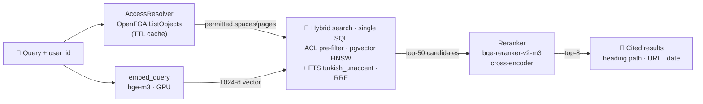

<div align="center">

# 🔐 ACL-Native Enterprise RAG

**Retrieval that respects document permissions — provably, on every commit.**

*Turkish-first · OpenFGA-filtered · citation-backed*

[](https://github.com/efkirmizi/rag-platform/actions/workflows/ci.yml)


**English** · [Türkçe](README.tr.md)

</div>

---

Most RAG systems treat authorization as an afterthought — they retrieve first and
filter later, or ignore permissions entirely. That breaks the moment you point one
at a real company's documents, where an HR salary page and a public handbook live
side by side.

This project makes permissions a **first-class part of retrieval**: the user's
permitted set is resolved from [OpenFGA](https://openfga.dev) and applied *inside
the SQL query*, so unauthorized content never enters the candidate list. There is
no post-filter to forget.

> [!WARNING]
> **Phase 0 proof of concept — do not deploy as-is.** The API takes `user_id` in
> the request body and has **no authentication**. See [SECURITY.md](SECURITY.md).

## Why this is different

| | |
|---|---|
| 🔐 **Fail-closed ACL pre-filter** | Permitted spaces/pages are applied as a SQL predicate in *both* retrieval arms. Empty access set ⇒ zero rows. A narrowly-permitted user gets correct results, not an empty page. |
| ✅ **Continuously proven** | Every push runs a leak test across every user × query combination and asserts each returned chunk is one that user is independently expected to see. Currently **0 leaks / 480 results**. |
| 🇹🇷 **Turkish-first** | Postgres FTS with the `turkish` stemmer + `unaccent`; embedding and reranker chosen by measured Turkish performance, including tokenizer efficiency. |
| 🔎 **Hybrid + rerank** | pgvector HNSW (dense) + full-text (lexical) fused with RRF, then a cross-encoder reranker. Error codes and acronyms don't slip through the cracks of dense-only search. |
| 📊 **Decisions are measured** | Model choices are settled with a golden-set eval harness, not vibes — see the [G-2 report](eval/results/g2-report.md). |

## Quickstart

**One command** (Docker; seeds a synthetic corpus and serves the API):

```bash
docker compose --profile demo up --build
```

Then query it as two different users and watch authorization work:

```bash
# ayşe can read the public leave policy
curl -X POST localhost:8000/v1/retrieve -H 'Content-Type: application/json' \
  -d '{"query":"yıllık izin kaç gün","user_id":"ayse"}'

# zeynep (HR management) can see the restricted salary page
curl -X POST localhost:8000/v1/retrieve -H 'Content-Type: application/json' \
  -d '{"query":"maaş bantları","user_id":"zeynep"}'

# mehmet can see the same space — but never that page
curl -X POST localhost:8000/v1/retrieve -H 'Content-Type: application/json' \
  -d '{"query":"maaş bantları","user_id":"mehmet"}'
```

<details>
<summary><b>Local development setup (without Docker for the app)</b></summary>

```bash
docker compose up -d                 # Postgres + pgvector, OpenFGA
python -m venv .venv && . .venv/bin/activate   # Windows: .venv\Scripts\activate
pip install -e ".[dev]"
python scripts/seed_synthetic.py     # synthetic corpus + permissions
python scripts/acl_leak_test.py      # the ACL acceptance test

python scripts/dev_query.py ayse "yıllık izin kaç gün"
uvicorn ragplatform.api.main:app --port 8000
```

For local embedding/reranker models (GPU auto-detected): `pip install -e ".[local]"`
</details>

## Use your own documents

Point it at a folder of markdown files with a permission manifest:

```bash
python scripts/ingest_folder.py --docs ./examples/docs --check   # validate first
python scripts/ingest_folder.py --docs ./examples/docs --reset   # index it
```

```
mydocs/
  permissions.json          # spaces, groups, who can see what
  handbook/onboarding.md    # markdown with front-matter
  handbook/policy.pdf       # PDF/DOCX/HTML via Docling  (pip install -e ".[docs]")
  eng/deployment.md
```

```markdown
---
space: HANDBOOK
title: Compensation bands
restricted_to: leadership     # optional: restricts this page within the space
---
Band figures are confidential...
```

`permissions.json` declares the org structure. `path_rules` assigns metadata by
directory — necessary for PDFs and DOCX, which can't carry front-matter (longest
matching prefix wins, so you can carve out an exception):

```json
{
  "spaces":        {"HANDBOOK": "Company Handbook", "ENG": "Engineering"},
  "groups":        {"everyone": ["alice","bob"], "leadership": ["alice"]},
  "space_viewers": {"HANDBOOK": ["everyone"], "ENG": ["engineering"]},

  "path_rules": [
    {"prefix": "handbook/",         "space": "HANDBOOK"},
    {"prefix": "handbook/private/", "space": "HANDBOOK", "restricted_to": "leadership"}
  ]
}
```

Front-matter overrides a rule when both apply.

The loader validates referential integrity up front (unknown space, unknown group,
duplicate keys, a space nobody can see) so mistakes surface as clear errors rather
than silently wrong permissions. A working example is in [`examples/docs/`](examples/docs).

## Answers with citations (optional)

Retrieval is the default; generation is opt-in. Enabled, the service answers from
**only** what the asking user is permitted to see:

```bash
# echo: no model (tests) · local: your GPU · openai: vLLM/OpenAI-compatible endpoint
GENERATION_PROVIDER=local GENERATION_MODEL=Qwen/Qwen2.5-1.5B-Instruct \
  uvicorn ragplatform.api.main:app --port 8000

curl -X POST localhost:8000/v1/answer -H 'Content-Type: application/json' \
  -d '{"query":"yıllık izin kaç gün","user_id":"ayse"}'
```

You get the answer plus the citations it actually used. Three properties matter:

- **ACL still governs.** The answer is generated only from retrieved chunks, and
  retrieval applies the permission filter in SQL. If the user may see nothing, the
  model is never called at all.
- **Retrieved text is untrusted data, not instructions** (ADR-8). Sources are
  delimited and the system prompt states that instructions inside them must be
  ignored. The service calls no tools, so a poisoned document has nothing to trigger.
- **Fabricated citations are surfaced,** not laundered — citation numbers that
  don't correspond to a real source are returned in `unsupported_citations`.

## How it works



The access set is resolved once per user (short TTL cache) and passed into the
query as a filter — see [`hybrid.py`](src/ragplatform/retrieval/hybrid.py), the
file where the project's core claim lives.

<details>
<summary><b>Authorization model (OpenFGA ReBAC)</b></summary>

```
space:  viewer: [user, group#member]
page:   parent: [space]
        restricted_viewer: [user, group#member]
        viewer: restricted_viewer or viewer from parent
```

Confluence semantics: a page restriction **narrows** access, never widens it.
Seeing a restricted page requires *both* space access and explicit
`restricted_viewer` membership; the SQL predicate enforces both.
</details>

## Status

| Milestone | | |
|---|:--:|---|
| **G-1** ACL-filtered hybrid retrieval | ✅ | 0 leaks / 480 results, p95 57ms |
| **G-2** Embedding + reranker selection | ✅ | bge-m3 chosen → [report](eval/results/g2-report.md) |
| **G-3** Golden eval set + harness | ✅ | 45 questions; hit@k, MRR, boundary, latency |
| **G-0** Discovery (real corpus, IdP, pilot) | ⬜ | Needs organizational access |
| **G-4** Infrastructure (K8s, vLLM, OIDC) | ⬜ | End of Phase 0 |

Full roadmap and architecture decisions: [PROJE-PLANI.md](PROJE-PLANI.md) *(Turkish)*.

## Model selection (G-2)

Measured on 45 golden questions over a 40-page deliberately-confusable corpus,
on an RTX 4050. Full analysis: [eval/results/g2-report.md](eval/results/g2-report.md).

| embedding | reranker | MRR | hit@1 | paraphrase@5 | tok/word |
|---|---|:--:|:--:|:--:|:--:|
| **bge-m3** ⭐ | bge-reranker-v2-m3 | **0.969** | **0.946** | **1.000** | **1.76** |
| bge-m3 | none | 0.937 | 0.919 | 0.909 | 1.76 |
| qwen3-0.6b | bge-reranker-v2-m3 | 0.969 | 0.946 | 1.000 | 2.62 |
| qwen3-0.6b | none | 0.896 | 0.838 | 0.909 | 2.62 |

**bge-m3 wins** on raw quality, Turkish token efficiency (~49% fewer tokens than
Qwen3-Embedding-0.6B → smaller context, lower cost), and latency. The reranker adds
+0.032 MRR and lifts paraphrase recall to 1.00. Zero ACL violations in all four cells.

> The corpus is synthetic (real pilot content is blocked on G-0), so this is a
> well-founded provisional decision — plus the tooling to re-run it in one command
> once real data exists: `python scripts/run_g2_matrix.py`.

## Testing

```bash
pytest                                                        # 75 unit tests, no services needed
python scripts/acl_leak_test.py                               # ACL gate — must be 0
python scripts/run_eval.py --golden eval/golden/golden_v2.jsonl   # eval gate (+ --min-mrr etc.)
python scripts/smoke_api.py                                   # end-to-end ACL check vs a running API
python scripts/run_g2_matrix.py                               # embedding × reranker matrix (GPU)
python scripts/run_chunking_matrix.py                         # chunk size / overlap matrix (GPU)
python scripts/scale_test.py --rows 100000                    # ACL-filtered ANN at scale ⚠️ heavy
```

CI runs the lint, unit tests, ACL leak test, eval gate, connector validation, and
boots the full Docker demo to assert end-to-end that a restricted page is not
returned to an unauthorized user.

## Project layout

```
src/ragplatform/
  acl/          OpenFGA client, access-set resolution, store bootstrap
  embeddings/   fake (tests) · local (GPU) · openai-compatible (vLLM)
  ingestion/    chunking · indexing · corpus model · folder connector
  retrieval/    hybrid search + RRF + reranker + service
  api/          FastAPI retrieval service
infra/          Postgres schema (pgvector + Turkish FTS), OpenFGA model
scripts/        seed · leak test · eval · model matrix · folder ingest
eval/           golden sets + committed result baselines
examples/docs/  bring-your-own-docs template
```

## Deliberate Phase 0 limits

- **No authentication** — `user_id` comes from the request body; OIDC is Phase 1.
- **Generation is minimal and opt-in** — single-turn, no streaming, no query
  rewriting; in production the LLM belongs behind the LiteLLM gateway (Phase 1).
- **Reranker runs in-process** — moves to a served pool in Phase 1.
- **Access set cached in-process** (short TTL) — durable materialization and
  permission sync are Phase 2.
- **Synthetic corpus** — real connectors (Confluence, Docling parsing) are Phase 1.

## Contributing

See [CONTRIBUTING.md](CONTRIBUTING.md). The one rule: retrieval must never return
content a user is not permitted to see — `python scripts/acl_leak_test.py` must
stay at 0. Found a permission bypass? Please report it privately
([SECURITY.md](SECURITY.md)).

## License

[Apache-2.0](LICENSE)
