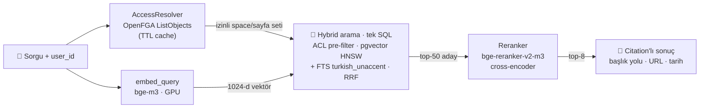

<div align="center">

# 🔐 Kurumsal RAG Platformu

**Erişim yetkilerine tam saygılı, kaynak gösteren, izlenebilir kurumsal RAG platformu.**

*Turkish-first · ACL-native · citation-backed retrieval*


</div>

---

Kurum içi dokümanlar (Confluence, PDF/DOCX/HTML) üzerinde çalışan bir soru-cevap
platformu. Ayırt edici yanı: **retrieval, kullanıcının erişim yetkilerine sorgu
anında ve fail-closed saygı gösterir** — izinsiz içerik aday listesine bile giremez.
LibreChat ilk tüketici; platform API'si üzerinden Teams/Slack/iç uygulamalar da bağlanabilir.

> **Bu repo Faz 0'dır** — projeyi batırabilecek riskli varsayımların prototiple
> doğrulandığı aşama. Tam vizyon, mimari ve yol haritası: **[PROJE-PLANI.md](PROJE-PLANI.md)**.

## ✨ Neden farklı?

| | |
|---|---|
| 🔐 **ACL-native retrieval** | OpenFGA erişim seti → SQL'de **pre-filter**. Post-filter yok; dar yetkili kullanıcı boş sonuç değil, *doğru ve izinli* sonuç alır. Sızıntı testi her sürümde koşar (0/480). |
| 🇹🇷 **Türkçe-öncelikli** | Postgres FTS `turkish` stemmer + `unaccent`; embedding/reranker Türkçe skoruna göre seçildi; token verimliliği ölçülüp maliyet planına bağlandı. |
| 🔎 **Hybrid + rerank** | pgvector HNSW (dense) + FTS (lexical) → RRF füzyonu → cross-encoder reranker. Hata kodu/kısaltma gibi lexical sorgular dense aramada kaçmaz. |
| 📄 **Citation-backed** | Her sonuç kaynak sayfa + başlık yolu + güncelleme tarihiyle döner. |
| 🧪 **Eval-gated** | Golden set + offline eval harness; kalite düşüren değişiklik ölçülebilir (Faz 2'de CI kapısı). |

## 📊 Durum

| Görev | Durum | Özet |
|---|:--:|---|
| **G-1** ACL-filtered hybrid retrieval PoC | ✅ | Sızıntı **0/480**, p95 **57ms** (40 sayfa, 6 kullanıcı) |
| **G-2** Embedding + reranker seçimi (ADR-3) | ✅ | **bge-m3** seçildi; reranker açık → [rapor](eval/results/g2-report.md) |
| **G-3** Golden eval seti + harness | ✅ | `golden_v2` 45 soru; hit@k / MRR / yetki-sınırı / latency |
| **G-0** Keşif (kurum bilgileri, pilot space, IdP) | ⬜ | Kurumsal erişim bekliyor |
| **G-4** Altyapı iskeleti (K8s, vLLM, OIDC) | ⬜ | Faz 0 sonu |

## 🏗️ Mimari (Faz 0 — retrieval hattı)



**Akış:** kullanıcının erişim seti OpenFGA'dan çözülür (kısa TTL cache) → sorgu
embed'lenir → hybrid arama **erişim setini SQL filtresine gömerek** (fail-closed)
top-50 aday çeker → cross-encoder reranker top-8'e indirger → citation üretilir.

<details>
<summary><b>OpenFGA yetki modeli (ReBAC)</b></summary>

```
space:  viewer: [user, group#member]
page:   parent: [space]
        restricted_viewer: [user, group#member]
        viewer: restricted_viewer or viewer from parent
```

Confluence semantiği: kısıt erişimi **daraltır**, genişletmez. Kısıtlı sayfayı
görmek için hem space erişimi hem açık `restricted_viewer` gerekir; SQL filtresi
her iki koşulu da uygular.
</details>

## 🧠 G-2 sonuçları — ADR-3 nasıl kapandı

Ölçüm: `golden_v2` (45 soru) · 40-sayfalık *confusable* korpus · RTX 4050 (fp16).
Tam analiz: **[eval/results/g2-report.md](eval/results/g2-report.md)**.

| embedding | reranker | MRR | hit@1 | parafraz@5 | tok/kelime |
|---|---|:--:|:--:|:--:|:--:|
| **bge-m3** ⭐ | bge-reranker-v2-m3 | **0.969** | **0.946** | **1.000** | **1.76** |
| bge-m3 | noop | 0.937 | 0.919 | 0.909 | 1.76 |
| qwen3-0.6b | bge-reranker-v2-m3 | 0.969 | 0.946 | 1.000 | 2.62 |
| qwen3-0.6b | noop | 0.896 | 0.838 | 0.909 | 2.62 |

**Karar: bge-m3 + reranker.** Rerank'siz kalitede Qwen3-Embedding-0.6B'yi geçiyor
(MRR 0.937 vs 0.896), Türkçe token verimi belirgin daha iyi (1.76 vs 2.62 tok/kelime
→ ~%49 daha küçük bağlam/maliyet) ve daha düşük latency. Reranker MRR'ı +0.032 artırıp
parafrazı 1.00'a taşıyor. **Tüm hücrelerde ACL ihlali 0.**

## 🚀 Kurulum

**Ön koşul:** Docker Desktop · Python 3.11+ · (opsiyonel) yerel model denemeleri için NVIDIA GPU.

```powershell
# 1) Altyapı (Postgres+pgvector, OpenFGA)
docker compose up -d

# 2) Python ortamı
python -m venv .venv
.venv\Scripts\activate
pip install -e ".[dev]"

# 3) Sentetik veri + izinler (OpenFGA store + 40 sayfa index)
python scripts/seed_synthetic.py

# 4) G-1 kabul testi: sızıntı = 0 + latency
python scripts/acl_leak_test.py
```

> Yerel embedding/reranker (bge-m3, bge-reranker-v2-m3) için: `pip install -e ".[local]"`
> (ilk koşuda modeller iner). GPU otomatik algılanır (`EMBEDDINGS_DEVICE=auto`).

## 💻 Kullanım

```powershell
# CLI ile hızlı sorgu — kullanıcı bazlı ACL uygulanır
python scripts/dev_query.py ayse   "yıllık izin kaç gün"
python scripts/dev_query.py zeynep "maaş bantları"     # kısıtlı sayfayı sadece zeynep görür
python scripts/dev_query.py mehmet "maaş bantları"     # mehmet göremez → sonuçta yok

# API
uvicorn ragplatform.api.main:app --port 8000
# POST http://localhost:8000/v1/retrieve  {"query": "...", "user_id": "ayse"}
```

### Eval ve model karşılaştırması

```powershell
# Golden set eval (hit@k / MRR / yetki-sınırı / latency)
python scripts/run_eval.py --golden eval/golden/golden_v2.jsonl

# G-2 tam matris: bge-m3 vs Qwen3 × noop vs reranker + token verimliliği (GPU)
python scripts/run_g2_matrix.py            # -> eval/results/g2-report.md

# Raporu kayıtlı JSON'dan yeniden render et (GPU gerekmez)
python scripts/g2_report.py
```

Golden set formatı ve kuralları: [eval/golden/README.md](eval/golden/README.md).
Eval sonuçları `eval/results/` altına yazılır ve baseline takibi için commit'lenir.

## 🧪 Testler

```powershell
pytest                              # birim testleri (servis/GPU gerektirmez) — 29 test
python scripts/acl_leak_test.py     # entegrasyon: G-1 kabul kriteri (sızıntı = 0)
python scripts/run_eval.py          # golden set eval: hit@k / MRR / yetki-sınırı
```

## 📁 Dizin yapısı

```
src/ragplatform/
  acl/          OpenFGA istemcisi + erişim seti çözümü (ADR-4)
  embeddings/   fake (test) · local (bge-m3/Qwen3, GPU) · openai-uyumlu (vLLM)
  ingestion/    chunker (Faz 1'de Docling ile değişecek) + indexer
  retrieval/    hybrid arama + RRF + reranker (noop/cross-encoder) + servis
  api/          FastAPI retrieval servisi
  hardware.py   GPU device/dtype çözümü (embedding + reranker paylaşır)
infra/
  db/init/      Postgres şeması (pgvector + turkish_unaccent FTS)
  openfga/      yetki modeli (DSL + JSON)
scripts/        seed · leak testi · dev CLI · eval · G-2 matris · token verimi
eval/           golden set + sonuçlar (baseline takibi)
tests/          birim testleri
docs/           tasarım spec'leri
```

## 🚧 Bilinçli sınırlar (Faz 0)

- **Reranker** bge-reranker-v2-m3 uygulandı ve ölçüldü (`RERANKER_PROVIDER=local`);
  varsayılan `noop`. Üretimde ayrı vLLM/servis havuzuna taşınacak.
- **`user_id`** istek gövdesinde — Faz 1'de OIDC token'dan gelecek.
- **Generation yok** — bu servis yalnız retrieval; LLM, LiteLLM gateway arkasında Faz 1'de.
- **Erişim seti cache'i** in-process TTL — Faz 1'de kalıcı materializasyon + izin senkronu.
- **Sentetik korpus** — gerçek Confluence erişimi (G-0) gelene kadar gerçekçi Türkçe senaryo.

## 🗺️ Yol haritası

Faz 1 (MVP: uçtan uca ACL'li + citation'lı Q&A) → Faz 2 (governance, güvenlik, eval
kapısı, izin tazeliği) → Faz 3 (ölçek, cache, HA). Kilit mimari kararlar (ADR) ve faz
çıkış kriterleri: **[PROJE-PLANI.md](PROJE-PLANI.md)**.
