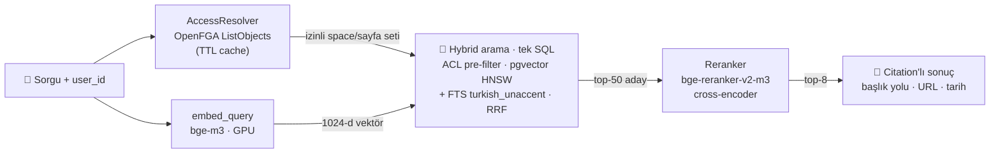

<div align="center">

# 🔐 ACL-Native Kurumsal RAG

**Doküman yetkilerine saygılı retrieval — her commit'te kanıtlanarak.**

*Türkçe-öncelikli · OpenFGA ile filtrelenen · kaynak gösteren*

[](https://github.com/efkirmizi/rag-platform/actions/workflows/ci.yml)


[English](README.md) · **Türkçe**

</div>

---

RAG sistemlerinin çoğu yetkilendirmeyi sonradan düşünür: önce getirir, sonra
filtreler — ya da izinleri tümden yok sayar. Gerçek bir kurumun dokümanlarına
yöneltildiği anda bu kırılır; İK'nın maaş sayfasıyla herkese açık el kitabı yan
yana durur.

Bu proje izinleri **retrieval'ın birinci sınıf parçası** yapar: kullanıcının
erişim seti [OpenFGA](https://openfga.dev)'dan çözülür ve **SQL sorgusunun
içinde** uygulanır — izinsiz içerik aday listesine hiç giremez. Unutulacak bir
post-filter yoktur.

> [!WARNING]
> **Faz 0 kavram kanıtı — olduğu gibi yayına almayın.** API `user_id`'yi istek
> gövdesinden alır ve **kimlik doğrulaması yoktur**. Bkz. [SECURITY.md](SECURITY.md).

## Neden farklı?

| | |
|---|---|
| 🔐 **Fail-closed ACL pre-filter** | İzinli space/sayfa seti her iki arama kolunda da SQL koşulu olarak uygulanır. Boş erişim seti ⇒ sıfır satır. Dar yetkili kullanıcı boş sayfa değil, doğru sonuç alır. |
| ✅ **Sürekli kanıtlanır** | Her push'ta her kullanıcı × sorgu kombinasyonu koşulur; dönen her chunk'ın o kullanıcının bağımsız olarak görmesi beklenen bir chunk olduğu doğrulanır. Şu an **0 sızıntı / 480 sonuç**. |
| 🇹🇷 **Türkçe-öncelikli** | Postgres FTS `turkish` stemmer + `unaccent`; embedding ve reranker ölçülmüş Türkçe performansına (tokenizer verimliliği dahil) göre seçildi. |
| 🔎 **Hybrid + rerank** | pgvector HNSW (dense) + tam metin (lexical), RRF ile füzyon, ardından cross-encoder reranker. Hata kodu ve kısaltmalar yalnız-dense aramanın çatlaklarından kaçmaz. |
| 📊 **Kararlar ölçülür** | Model seçimleri golden set eval harness'ı ile kapanır, sezgiyle değil — bkz. [G-2 raporu](eval/results/g2-report.md). |

## Hızlı başlangıç

**Tek komut** (Docker; sentetik korpusu seed'ler ve API'yi yayına alır):

```bash
docker compose --profile demo up --build
```

Ardından iki farklı kullanıcı olarak sorgulayıp yetkilendirmeyi çalışırken görün:

```bash
# ayşe herkese açık izin politikasını okuyabilir
curl -X POST localhost:8000/v1/retrieve -H 'Content-Type: application/json' \
  -d '{"query":"yıllık izin kaç gün","user_id":"ayse"}'

# zeynep (İK yönetimi) kısıtlı maaş sayfasını görebilir
curl -X POST localhost:8000/v1/retrieve -H 'Content-Type: application/json' \
  -d '{"query":"maaş bantları","user_id":"zeynep"}'

# mehmet aynı space'i görür — ama o sayfayı asla
curl -X POST localhost:8000/v1/retrieve -H 'Content-Type: application/json' \
  -d '{"query":"maaş bantları","user_id":"mehmet"}'
```

<details>
<summary><b>Yerel geliştirme kurulumu (uygulama Docker'sız)</b></summary>

```powershell
docker compose up -d                 # Postgres + pgvector, OpenFGA
python -m venv .venv
.venv\Scripts\activate
pip install -e ".[dev]"
python scripts/seed_synthetic.py     # sentetik korpus + izinler
python scripts/acl_leak_test.py      # ACL kabul testi

python scripts/dev_query.py ayse "yıllık izin kaç gün"
uvicorn ragplatform.api.main:app --port 8000
```

Yerel embedding/reranker modelleri için (GPU otomatik algılanır): `pip install -e ".[local]"`
</details>

## Kendi dokümanlarınızı kullanın

Markdown dosyaları ve bir izin manifest'i içeren klasörü gösterin:

```powershell
python scripts/ingest_folder.py --docs ./examples/docs --check   # önce doğrula
python scripts/ingest_folder.py --docs ./examples/docs --reset   # indexle
```

```
belgelerim/
  permissions.json          # space'ler, gruplar, kim neyi görür
  elkitabi/oryantasyon.md   # front-matter'lı markdown
  eng/dagitim.md
```

```markdown
---
space: HANDBOOK
title: Maaş bantları
restricted_to: leadership     # opsiyonel: sayfayı space içinde kısıtlar
---
Bant bilgileri gizlidir...
```

`permissions.json` kurum yapısını tanımlar:

```json
{
  "spaces":        {"HANDBOOK": "El Kitabı", "ENG": "Mühendislik"},
  "groups":        {"everyone": ["alice","bob"], "leadership": ["alice"]},
  "space_viewers": {"HANDBOOK": ["everyone"], "ENG": ["engineering"]}
}
```

Yükleyici referans bütünlüğünü baştan doğrular (tanımsız space, tanımsız grup,
tekrar eden anahtar, kimsenin göremediği space) — hatalar sessiz yanlış izin
yerine anlaşılır mesaj olarak çıkar. Çalışan örnek: [`examples/docs/`](examples/docs).

## Nasıl çalışır



Erişim seti kullanıcı başına bir kez çözülür (kısa TTL cache) ve sorguya filtre
olarak geçer — projenin temel iddiasının yaşadığı dosya:
[`hybrid.py`](src/ragplatform/retrieval/hybrid.py).

<details>
<summary><b>Yetki modeli (OpenFGA ReBAC)</b></summary>

```
space:  viewer: [user, group#member]
page:   parent: [space]
        restricted_viewer: [user, group#member]
        viewer: restricted_viewer or viewer from parent
```

Confluence semantiği: sayfa kısıtı erişimi **daraltır**, asla genişletmez.
Kısıtlı sayfayı görmek için hem space erişimi hem açık `restricted_viewer`
üyeliği gerekir; SQL koşulu ikisini de uygular.
</details>

## Durum

| Görev | | |
|---|:--:|---|
| **G-1** ACL-filtered hybrid retrieval | ✅ | 0 sızıntı / 480 sonuç, p95 57ms |
| **G-2** Embedding + reranker seçimi | ✅ | bge-m3 seçildi → [rapor](eval/results/g2-report.md) |
| **G-3** Golden eval seti + harness | ✅ | 45 soru; hit@k, MRR, yetki-sınırı, latency |
| **G-0** Keşif (gerçek korpus, IdP, pilot) | ⬜ | Kurumsal erişim bekliyor |
| **G-4** Altyapı (K8s, vLLM, OIDC) | ⬜ | Faz 0 sonu |

Tam yol haritası ve mimari kararlar: [PROJE-PLANI.md](PROJE-PLANI.md).

## Model seçimi (G-2)

40 sayfalık, bilinçli olarak karıştırılabilir bir korpus üzerinde 45 golden soru
ile RTX 4050'de ölçüldü. Tam analiz: [eval/results/g2-report.md](eval/results/g2-report.md).

| embedding | reranker | MRR | hit@1 | parafraz@5 | tok/kelime |
|---|---|:--:|:--:|:--:|:--:|
| **bge-m3** ⭐ | bge-reranker-v2-m3 | **0.969** | **0.946** | **1.000** | **1.76** |
| bge-m3 | yok | 0.937 | 0.919 | 0.909 | 1.76 |
| qwen3-0.6b | bge-reranker-v2-m3 | 0.969 | 0.946 | 1.000 | 2.62 |
| qwen3-0.6b | yok | 0.896 | 0.838 | 0.909 | 2.62 |

**bge-m3 kazanıyor**: ham kalite, Türkçe token verimi (Qwen3-Embedding-0.6B'den
~%49 daha az token → daha küçük bağlam, daha düşük maliyet) ve latency. Reranker
MRR'ı +0.032 artırıp parafraz recall'ını 1.00'a taşıyor. Dört hücrede de ACL
ihlali sıfır.

> Korpus sentetiktir (gerçek pilot içeriği G-0'a bağlı), yani bu iyi temellenmiş
> geçici bir karardır — üstelik gerçek veri geldiğinde tek komutla yeniden
> koşacak araçla birlikte: `python scripts/run_g2_matrix.py`.

## Testler

```powershell
pytest                                                        # 49 birim testi, servis gerekmez
python scripts/acl_leak_test.py                               # ACL kapısı — 0 olmalı
python scripts/run_eval.py --golden eval/golden/golden_v2.jsonl   # eval kapısı
python scripts/smoke_api.py                                   # çalışan API'ye uçtan uca ACL testi
python scripts/run_g2_matrix.py                               # tam model matrisi (GPU)
```

CI; lint, birim testleri, ACL sızıntı testi, eval kapısı ve connector
doğrulamasını koşar; ayrıca tam Docker demosunu ayağa kaldırıp kısıtlı bir
sayfanın yetkisiz kullanıcıya dönmediğini uçtan uca doğrular.

## Dizin yapısı

```
src/ragplatform/
  acl/          OpenFGA istemcisi, erişim seti çözümü, store bootstrap
  embeddings/   fake (test) · local (GPU) · openai-uyumlu (vLLM)
  ingestion/    chunking · indexleme · korpus modeli · klasör connector'ı
  retrieval/    hybrid arama + RRF + reranker + servis
  api/          FastAPI retrieval servisi
infra/          Postgres şeması (pgvector + Türkçe FTS), OpenFGA modeli
scripts/        seed · leak testi · eval · model matrisi · klasör ingest
eval/           golden setler + commit'lenmiş baseline sonuçları
examples/docs/  kendi-dokümanını-getir şablonu
```

## Bilinçli Faz 0 sınırları

- **Kimlik doğrulama yok** — `user_id` istek gövdesinden gelir; OIDC Faz 1'de.
- **Generation yok** — yalnız retrieval; LLM Faz 1'de gateway arkasında.
- **Reranker in-process** — Faz 1'de ayrı servis havuzuna taşınır.
- **Erişim seti in-process cache** (kısa TTL) — kalıcı materializasyon ve izin
  senkronu Faz 2'de.
- **Sentetik korpus** — gerçek connector'lar (Confluence, Docling) Faz 1'de.

## Katkı

Bkz. [CONTRIBUTING.md](CONTRIBUTING.md). Tek kural: retrieval, kullanıcının
görmemesi gereken içeriği asla döndürmemeli — `python scripts/acl_leak_test.py`
0'da kalmalı. Yetki atlatma bulduysanız lütfen gizli bildirin
([SECURITY.md](SECURITY.md)).

## Lisans

[Apache-2.0](LICENSE)
